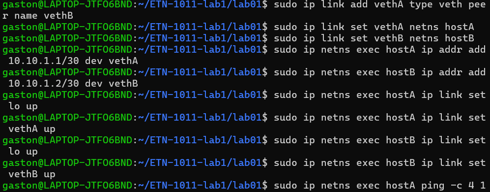
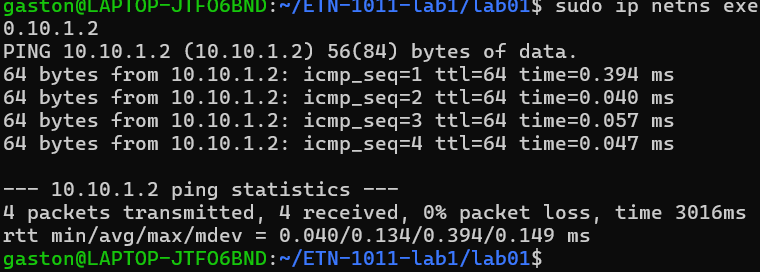
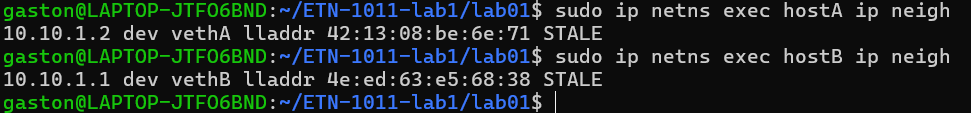

# Laboratorio 1 — Redes virtuales con Linux

## 1. Datos del estudiante y del entorno
* **Nombre:** Apaza Queso Gaston Jhonny[cite: 1]
* **Carrera / Materia:** Ingeniería Electrónica / ETN1011 - Laboratorio de Sistemas de Comunicación II[cite: 1, 2]
* **Universidad:** Universidad Mayor de San Andrés (UMSA)[cite: 1]
* **Fecha:** 2026-09-29
* **Entorno de trabajo:** WSL2 (Ubuntu / Debian)[cite: 2]

---

## 2. Objetivo
Construir y verificar una red virtual aislada utilizando las capacidades de networking del kernel Linux, implementando *network namespaces* y enlaces virtuales tipo `veth`, configurando direccionamiento IPv4, analizando la tabla de rutas, evaluando la resolución de vecinos y diagnosticando fallas controladas.

---

## 3. Topología de Red Implementada
Se configuró una topología punto a punto interconectando dos espacios de red aislados (`hostA` y `hostB`) mediante un cable Ethernet virtual (`veth`), utilizando la subred `10.10.1.0/30`.
  __________________                 __________________
 |                  |                |                 |
 |                  |                |                 |
 |   hostA          |<<===========>> |   hostB         |
 |   10.10.1.1/30   | vethA----vethB |   10.10.1.2/30  |
 |                  |                |                 |
 |__________________|                |_________________|

---

## 4. Procedimiento y Comandos Ejecutados

### Paso 4.1: Creación de los Network Namespaces
Se crearon dos espacios de red independientes para representar nodos lógicos distintos dentro de la misma máquina:
```bash
sudo ip netns add hostA
sudo ip netns add hostB
ip netns list

###Paso 4.2: Creación y asignación del enlace virtual (veth)
Se generó un par de interfaces virtuales interconectadas y se asignó cada extremo al namespace correspondiente[cite: 2, 3]:

sudo ip link add vethA type veth peer name vethB
sudo ip link set vethA netns hostA
sudo ip link set vethB netns hostB

Verificación de las interfaces dentro de cada espacio:

sudo ip netns exec hostA ip link
sudo ip netns exec hostB ip link

###Paso 4.3: Direccionamiento IP y Puesta en Servicio
Se asignaron las direcciones IPv4 correspondientes al prefijo /30 y se activaron las interfaces (up), incluyendo la interfaz de loopback (lo):

sudo ip netns exec hostA ip addr add 10.10.1.1/30 dev vethA
sudo ip netns exec hostB ip addr add 10.10.1.2/30 dev vethB

sudo ip netns exec hostA ip link set lo up
sudo ip netns exec hostA ip link set vethA up
sudo ip netns exec hostB ip link set lo up
sudo ip netns exec hostB ip link set vethB up

Verificación del direccionamiento configurado:

sudo ip netns exec hostA ip addr
sudo ip netns exec hostB ip addr



###Paso 4.4: Análisis de la Tabla de Rutas
Se inspeccionaron las rutas generadas automáticamente por el kernel para el direccionamiento directo de red:

sudo ip netns exec hostA ip route
sudo ip netns exec hostB ip route

##5. Pruebas de Verificación y Conectividad
###5.1. Prueba de Conectividad (ping)
Se comprobó la comunicación exitosa entre ambos extremos mediante el protocolo ICMP

sudo ip netns exec hostA ping -c 4 10.10.1.2



###5.2. Tabla de Vecinos (Resolución de Capa 2)
Se examinó la tabla de vecinos para observar el mapeo de direcciones IP a direcciones físicas MAC:

sudo ip netns exec hostA ip neigh
sudo ip netns exec hostB ip neigh



##6. Falla Controlada y Diagnóstico
Para evaluar el comportamiento de la red ante fallas físicas virtuales, se ejecutó el siguiente procedimiento:
Provocar la caída del enlace: Se desactivó la interfaz en el nodo B:

sudo ip netns exec hostB ip link set vethB down

Prueba de fallo: Se intentó realizar el ping desde el nodo A:

sudo ip netns exec hostA ping -c 4 10.10.1.2

##7. Conclusiones
Los network namespaces de Linux proporcionan una herramienta potente y ligera para aislar entornos de red sin necesidad de recurrir a máquinas virtuales pesadas, facilitando la experimentación local.

Los pares de interfaces virtuales (veth) actúan de manera transparente como un medio físico de transmisión punto a punto, permitiendo el flujo de tramas de capa 2 y paquetes de capa 3 entre diferentes espacios de red.

El dominio de los comandos de la suite iproute2 (ip link, ip addr, ip route, ip neigh) es indispensable para el monitoreo, diseño y estructuración de diagnósticos precisos ante fallas en sistemas de comunicación.


